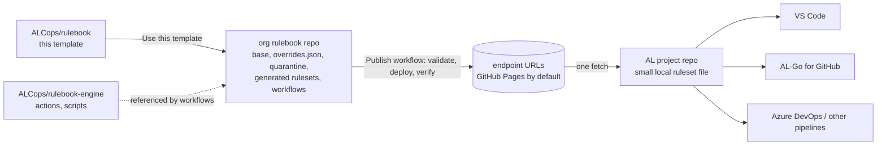

# Rulebook

Rulebook is a GitHub template plus automation for managing the ruleset files that drive code analysis in Microsoft Dynamics 365 Business Central AL projects. One repository per organization holds the rules for every analyzer (CodeCop, UICop, AppSourceCop, PerTenantExtensionCop and the ALCops cops), publishes them as URLs, and keeps them current with workflows. AL projects point at those URLs from VS Code, AL-Go for GitHub, Azure DevOps or any other pipeline that runs the AL compiler.

> **Status:** design phase. This repository holds the user-facing documentation only; the template content (rulesets, workflows, skeletons) arrives with the work packages of [ALCops/rulebook-engine](https://github.com/ALCops/rulebook-engine), tracked on the [Rulebook v1 board](https://github.com/orgs/ALCops/projects/1). Nothing here is usable yet.

---

## Contents

1. [What Rulebook does](#1-what-rulebook-does)
2. [How it fits together](#2-how-it-fits-together)
3. [Getting started](#3-getting-started)
4. [Consumer paths](#4-consumer-paths)
5. [Documentation](#5-documentation)
6. [Related repositories](#6-related-repositories)

---

## 1. What Rulebook does

| Need | Rulebook answer |
|---|---|
| Decide once which diagnostic is shown at which severity, for the whole organization | One **org rulebook repo** created from this template. |
| Different severities for development, pull-request builds and next-major builds | Configurable **stages**. Shipped: `default` (the editor and any consumer without its own stage), `CI` (pull request and release builds), `vNext` (builds against the next platform). Add or remove stages in the settings. |
| Per-tenant extension or AppSource app? | Rulebook does not ask. Both Microsoft cops run at their native severity; a project opts out of the rules written for the other kind with `suppressWarnings` in `app.json`, with its own ruleset file, or by disabling a cop. See [docs/pte-or-appsource.md](docs/pte-or-appsource.md). |
| Start strict or start lenient, and grow | An ordered ladder of **levels**. Shipped: Essential, Recommended, Strict and Complete, each defined as the level below plus the rules it changes. Insert your own level, alias one under another name, start with everything off, or stop publishing one, all in the settings ([docs/levels.md](docs/levels.md)). |
| One URL for `al.ruleSetPath`, the AL-Go `rulesetFile`, or a small local file | One **endpoint** per level and stage: a single flat ruleset file that lists only the diagnostics whose severity differs from the analyzer default, so a compile fetches one small file. Published by a workflow. |
| New analyzer rules must not break a green pipeline | A daily **scan** of the compiler and ALCops packages quarantines new diagnostic ids per stage, reports changed default severities, and regenerates the endpoints. |
| Change a rule without editing dozens of files | A **workflow form** that writes one entry to `overrides.json`, regenerates the endpoints and opens a pull request that shows the change per endpoint. See [docs/changing-a-rule.md](docs/changing-a-rule.md); the file itself is [docs/overrides.md](docs/overrides.md). |
| Keep the automation up to date without losing your own decisions | An **update workflow** modelled on AL-Go's "Update AL-Go System Files": a pull request with the new template files and the regenerated endpoints, your overrides and settings kept. See [docs/updating.md](docs/updating.md); the write token is [docs/ghtokenworkflow.md](docs/ghtokenworkflow.md). |

## 2. How it fits together

An endpoint URL has the form `<baseUrl>/rulesets/<level>.<stage>.ruleset.json`, or `<baseUrl>/rulesets/<level>.ruleset.json` for the `default` stage. Level and stage names are lowercased in the URL: `https://contoso.github.io/rulebook/rulesets/strict.ci.ruleset.json`, `https://contoso.github.io/rulebook/rulesets/strict.ruleset.json`. Every endpoint is generated from the level's chain of files, the stage file, your `twins` setting, `overrides.json` and quarantine files. It lists the diagnostics whose action differs from the analyzer default and has no includes.

## 3. Getting started

1. Press **Use this template** and create your org rulebook repo.
2. In `.github/Rulebook-Settings.json`, set `baseUrl`, the quarantine policy and, if every project you build is of one kind, the `twins` setting.
3. Turn on GitHub Pages once (Settings > Pages > Source **GitHub Actions**) and add the `GHTOKENWORKFLOW` secret for the workflows that write ([docs/ghtokenworkflow.md](docs/ghtokenworkflow.md)).
4. Merge and run **Publish**; `<baseUrl>/` then lists every endpoint and skeleton ([docs/hosting.md](docs/hosting.md)).
5. Point your AL projects at the endpoints: [VS Code](docs/vscode.md), [AL-Go for GitHub](docs/al-go.md), [Azure DevOps and other pipelines](docs/azure-devops.md).

The full walkthrough, with the checks after each step, is [docs/getting-started.md](docs/getting-started.md); every page is listed in [docs/README.md](docs/README.md).

## 4. Consumer paths

| Consumer | Setting | Typical stage | External rulesets | Walkthrough |
|---|---|---|---|---|
| VS Code AL extension | `al.ruleSetPath` (local file or URL) | `default` | `al.enableExternalRulesets`, default true | [docs/vscode.md](docs/vscode.md) |
| AL-Go for GitHub | `rulesetFile` in `.AL-Go/settings.json`, per workflow via `.github/<workflow name>.settings.json` | `ci`; `vnext` in `.github/Test Next Major.settings.json` | `enableExternalRulesets` | [docs/al-go.md](docs/al-go.md) |
| BcContainerHelper / custom PowerShell | `-rulesetFile` | `ci` | `-enableExternalRulesets` | [docs/azure-devops.md](docs/azure-devops.md) |
| ALOps (Azure DevOps) | `ruleset` input of `ALOpsAppCompiler@3` | `ci` | `enable_external_rulesets` | [docs/azure-devops.md](docs/azure-devops.md) |
| `alc` directly | `/ruleset:<path>` | any | `/enableexternalrulesets` (default false) | [docs/azure-devops.md](docs/azure-devops.md) |

## 5. Documentation

User documentation lives in [docs/](docs/README.md) in this repository: start with [getting-started.md](docs/getting-started.md), the consumer walkthroughs and the [FAQ](docs/faq.md). Architecture, decisions and references live in [rulebook-engine/docs](https://github.com/ALCops/rulebook-engine/tree/main/docs); the work packages are issues on the [Rulebook v1 board](https://github.com/orgs/ALCops/projects/1). When version 1.0 ships, the user documentation moves to [alcops.dev](https://alcops.dev).

**Issues and contributions.** Issues are disabled on this repository. Report problems and ideas in [ALCops/rulebook-engine](https://github.com/ALCops/rulebook-engine/issues); status and order of the work are on the [Rulebook v1 board](https://github.com/orgs/ALCops/projects/1). Organizations that create their own repository from this template handle issues there as they see fit.

## 6. Related repositories

- [ALCops/rulebook-engine](https://github.com/ALCops/rulebook-engine): the composite actions, PowerShell modules, tests and contributor documentation that the workflows in this template call.
- [ALCops/Analyzers](https://github.com/ALCops/Analyzers): the ALCops analyzers whose rules Rulebook manages next to Microsoft's cops.
- [microsoft/AL-Go](https://github.com/microsoft/AL-Go): the CI/CD system whose template and update mechanics Rulebook reuses.

## License

MIT, see [LICENSE](LICENSE).
