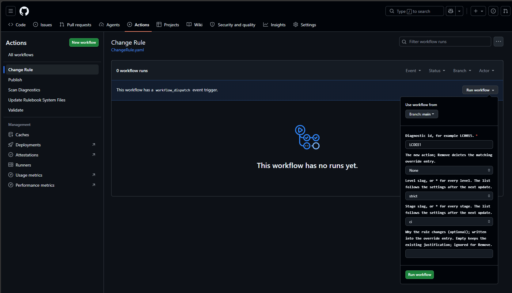
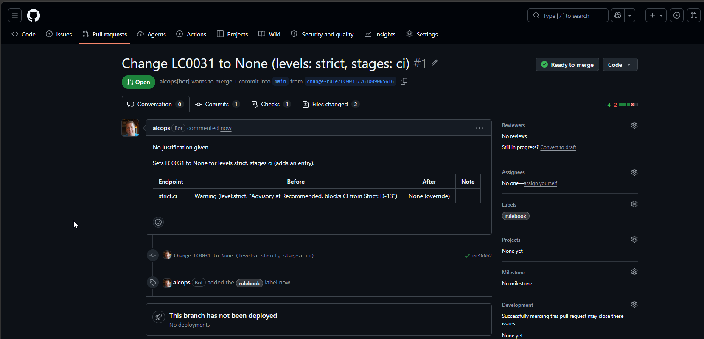

# Changing a rule

Your organization decides that a rule should be off for Strict in CI, or that a rule the levels leave off should be an error everywhere. The **Change Rule** workflow does that from a form: it writes one entry to `overrides.json`, regenerates the endpoints, validates the result and opens a pull request whose table shows, for every endpoint the change applies to, the action before and after. Nobody edits a JSON file by hand, and the reviewer sees what changes for the AL projects.

> **Status:** written 2026-10-09 with the change-rule work package of the engine ([WP09, #11](https://github.com/ALCops/rulebook-engine/issues/11)). Everything below was observed in a live run on a scratch repository or is stated by the engine's contributor reference, [change-mechanics.md](https://github.com/ALCops/rulebook-engine/blob/main/docs/reference/change-mechanics.md), which also holds the run table. The file the workflow writes is described in [overrides.md](overrides.md). The workflow writes with the same secret as the update: [ghtokenworkflow.md](ghtokenworkflow.md).

## Contents

1. [What the workflow does](#1-what-the-workflow-does)
2. [Running it](#2-running-it)
3. [Reading the pull request](#3-reading-the-pull-request)
4. [When nothing happens](#4-when-nothing-happens)
5. [Where the change lands](#5-where-the-change-lands)
6. [The secret](#6-the-secret)
7. [Your own levels and stages](#7-your-own-levels-and-stages)
8. [Troubleshooting](#8-troubleshooting)

## 1. What the workflow does

One run changes one rule for a selection of levels and stages:

1. It checks the input before any file is touched: the id must look like a diagnostic id and be in your catalog, the level and stage must be in your settings.
2. It sets the entry in `overrides.json` for that id and selection, or removes it. An entry with the same id and the same levels and stages is replaced, so the file never collects two entries for one selection.
3. It regenerates `rulesets/` and runs the full validation on the result.
4. It lands the change as a pull request on a new branch (or, when your settings say so, as a commit on the branch, [section 5](#5-where-the-change-lands)).

When the change would alter no endpoint and no entry, nothing is written and the run says why: the entry would stay as it is, or a new entry would not change any endpoint ([section 4](#4-when-nothing-happens)). A change that alters only the file is written: a new justification, a new action that a more specific entry hides everywhere, or duplicate entries a hand edit left. The workflow never edits the level or stage files: an override sits on top of them and wins for the selection it names, on exactly the levels it names: an override for `strict` does not reach `complete`, even though Complete is based on Strict ([overrides.md](overrides.md) section 2).

## 2. Running it

Actions > **Change Rule** > Run workflow, on the branch whose rules you change (normally `main`):

| Field | Values | Notes |
|---|---|---|
| Diagnostic id | for example `LC0015` | Two or three capital letters, four digits, an optional `i`; it must be in `catalog/diagnostics.json`. |
| The new action | `Error`, `Warning`, `Info`, `Hidden`, `None`, `Remove` | No default: the dropdown opens on `Error`, and the level and stage open on `*`, so a run with only the id filled in raises the rule to `Error` everywhere. Pick the action every time. `Remove` deletes the entry with exactly this level and stage selection. |
| Level slug | `*` (default) or one level, for example `strict` | `*` selects every level of your settings. A level is only that level: `strict` does not include `complete`. |
| Stage slug | `*` (default) or one stage, for example `ci` | `*` selects every stage. |
| Why the rule changes | free text, optional | Written into the entry. Empty keeps the text an existing entry already has; ignored for `Remove`. |

One run selects one level (or all) and one stage (or all). For a selection of two levels, run the form twice, or write one entry with both slugs by hand ([overrides.md](overrides.md)). A justification you type for a change that writes nothing is not stored; the job summary then says "Justification given but not stored (no entry was written): `<text>`".

The justification is optional, and worth writing: it travels with the entry, appears in the pull request table, and is what the next person reads when they wonder why a rule is off. To correct it later, run the form again with the same action, selection and the new text ([section 3](#3-reading-the-pull-request)). Clearing a justification is a hand edit.

## 3. Reading the pull request

The branch is `change-rule/<id>/<yyMMddHHmmss>` (UTC), the title names the change, for example `Change LC0031 to None (levels: strict, stages: ci)` or `Remove override for LC0031 (levels: strict, stages: ci)`, and the pull request gets the labels in `commitOptions.pullRequestLabels` (shipped: `rulebook`). It is opened by the GitHub App or token of the secret, so your Validate workflow runs on it like on any pull request.

The body has:

1. **The justification**, `Justification: <text>`, or `No justification given.` A remove has no such line.
2. **One sentence** that says what happens to the entry: `Sets LC0031 to None for levels strict, stages ci (adds an entry).`, `(replaces the entry that was Warning)`, `Updates the justification of the LC0031 entry ... (the action stays None).`, `Removes the override entry for LC0031 with levels strict, stages ci (it was None).`
3. **A table** with one row for every endpoint the selection matches, `*` expanded in the order of your settings:

   | Endpoint | Before | After | Note |
   |---|---|---|---|
   | strict.ci | Warning (level:strict, "Advisory at Recommended, blocks CI from Strict; D-13") | None (override) |  |

   Each side is the action with the input that decides it, and that input's justification in quotes when it has one:

   | Token | Decided by |
   |---|---|
   | `override` | an entry in `overrides.json` |
   | `level:<slug>` | a level file on the chain (`level:recommended` is `base/recommended.ruleset.json`) |
   | `stage:<slug>` | the stage file (`stages/ci.json` for `stage:ci`) |
   | `twins` | your `twins` setting ([pte-or-appsource.md](pte-or-appsource.md)) |
   | `quarantine` | a quarantine file ([quarantine.md](quarantine.md)) |
   | `default` | nothing: the analyzer's own default severity |

   The Note column says `unchanged` for an endpoint the change does not alter (a change for `*` often leaves some endpoints as they were: in the live run, setting AA0001 to None for every level and stage changed nine endpoints and left the three Essential ones, where the level already had it at None), `justification updated` when only the text changed, `duplicate entries removed` when the run collapsed entries with the same selection that a hand edit left, and `now unlisted in <endpoint>: <action> equals the analyzer default` when the new action is the analyzer's default. An endpoint lists only the rules that differ from the default, so such a rule disappears from the file: setting AL0432 to Warning, its default, removed it from seven endpoints in the live run, and the pull request said so in each row and in a list below the table.
4. **Notes** below the table: the rules that become unlisted, and how many matching endpoints stay the same, for example `3 of 12 matching endpoints are unchanged.`

The files are `overrides.json` and the endpoint files that change. The endpoints are regenerated as a whole, so an endpoint that was already out of date (after a hand edit of a level or quarantine file without regenerating) is brought up to date in the same pull request too. A remove changes only the one line of the entry in `overrides.json`; the rest of the file keeps its bytes. A justification-only change touches `overrides.json` alone.

The job summary of the run has the same table and, after the push, the effective diff of the commit per endpoint: the view Validate shows on the pull request.

## 4. When nothing happens

**Nothing would change.** When no endpoint would change and the entry would stay as it is (same action, and the justification empty or the same), or a new entry would only repeat what the selected endpoints already give, the run succeeds without writing anything and says so ([D48](https://github.com/ALCops/rulebook-engine/blob/main/docs/adr/0048-no-op-changes-are-reported-and-never-written.md)):

> No change: LC0031 is already None on every matching endpoint (strict.ci); overrides.json was not written

That covers running the same change twice and adding an entry that only repeats what the levels already give. An existing entry for the same selection with another action is different: it is replaced and written even when every selected endpoint already shows the requested action (a more specific entry hides it there), and the table then shows every row `unchanged`. When a more specific entry or another input keeps a different action on some of the endpoints, the notice says which:

> No change: LC0015 keeps its effective action on every matching endpoint (2 at Warning; 1 decided by a more specific entry or input: strict.ci None (override)); overrides.json was not written

No pull request is opened and no token is used. A change of only the justification is not "nothing": it is written ([section 3](#3-reading-the-pull-request)).

**Remove finds no entry.** `Remove` deletes the entry with exactly the selection you chose. When there is none, the run fails and lists the entries the id has, so you can run it again with the right selection:

> overrides.json has no entry for AA0001 with levels [strict] and stages [ci]; existing entries for AA0001: None (levels: *, stages: *)

To lift `AA0001` for Strict in CI while the `*` entry stays, set a new action for `strict` and `ci` instead: the more specific entry wins there ([overrides.md](overrides.md)).

## 5. Where the change lands

`commitOptions.createPullRequest` in `.github/Rulebook-Settings.json` decides, on every run:

| Setting | Result |
|---|---|
| `true` (shipped) or absent | A pull request from `change-rule/<id>/<yyMMddHHmmss>`. |
| `false` | A commit on the branch the workflow runs on. The commit message is the title (for example `Change AA0072 to Info (levels: *, stages: *)`); the run's notice says "Rule change committed to main (`<sha7>`)". |

There is no form field for this; the setting is your organization's choice for every change ([D47](https://github.com/ALCops/rulebook-engine/blob/main/docs/adr/0047-changerule-follows-commitoptions-and-has-no-directcommit-input.md)). When branch protection or a ruleset refuses the direct push, the run opens the pull request instead, and its notice ends with "(the direct commit was refused)" (observed with a ruleset that requires pull requests). Several runs are queued, not run at the same time; when a third is started while one runs and one waits, GitHub cancels the waiting one, so start that change again.

## 6. The secret

The workflow pushes and opens the pull request with the token from the `GHTOKENWORKFLOW` secret, the same secret the update and the scan use ([ghtokenworkflow.md](ghtokenworkflow.md)), so the pull request runs Validate. A run that only answers "no change" or fails on its input does not need the secret. A real change without it fails with:

> The GHTOKENWORKFLOW secret is needed to change a rule. Read https://github.com/ALCops/rulebook/blob/main/docs/ghtokenworkflow.md

## 7. Your own levels and stages

The level and stage dropdowns list `*` and the slugs of your settings in settings order. The list is written into `ChangeRule.yaml` by the update ([updating.md](updating.md) section 1): after you add a level or stage to the settings, run **Update Rulebook System Files** once, and its pull request adds the slug to the form. In the live run, a level `House` added after `Recommended` appeared as `- house` between `recommended` and `strict`, and that line was the only change to the workflow file.

Until that update is merged, the dropdown shows the old list. The workflow checks the selection against the current settings in any case, so a slug that is no longer in the settings is refused before anything is written.

## 8. Troubleshooting

| Message | Cause | Fix |
|---|---|---|
| "'`<id>`' is not a diagnostic id: two or three capital letters, four digits and an optional i, for example LC0015" | A typo in the id. | Run again with the exact id. |
| "`<id>` is not in catalog/diagnostics.json" | The id is not in your catalog: a typo, or a diagnostic of a package version the scan has not read yet. | Check the id; run Scan Diagnostics ([quarantine.md](quarantine.md)) for a new diagnostic. |
| "change 0 names unknown level '`<slug>`'; use a slug from the settings or [\"*\"]" | The dropdown is older than your settings ([section 7](#7-your-own-levels-and-stages)). | Pick a current slug, or run the update to refresh the form. |
| "overrides.json has no entry for `<id>` ..." | `Remove` with a selection that has no entry ([section 4](#4-when-nothing-happens)). | Use a selection the message lists. |
| "The changed rulebook would not validate: ..." | The repository after the change has an error, often one it already had. | Fix the reported file, then run again. |
| "The GHTOKENWORKFLOW secret is needed to change a rule. ..." | No secret, or this repository cannot see it. | Create it ([ghtokenworkflow.md](ghtokenworkflow.md)); with another name, set `ghTokenWorkflowSecretName`. |
| The step "Read the settings" fails on reading `.github/Rulebook-Settings.json` | The settings file is missing (or not JSON) on the branch the workflow runs on. | Run the workflow from a branch of your rulebook repository that has the settings; restore the file. |
| "ghTokenWorkflowSecretName '`<name>`' is not a valid secret name", in the step "Read the settings" before the change runs | `ghTokenWorkflowSecretName` in the settings is not a valid secret name (letters, digits and underscores, not starting with a digit or `GITHUB_`). | Correct or remove the key. Validate reports the same value as a settings error. |
| "The GHTOKENWORKFLOW secret could not be used: ..." | The App is not installed on this repository, or the App JSON or the token is wrong. | [ghtokenworkflow.md](ghtokenworkflow.md) section 6. |
| "Failed to push the rule change. Make sure that the token in the secret GHTOKENWORKFLOW is not expired and may write contents and pull requests of `<repository>` ..." | Cloning or pushing failed. | Renew the token or add the permission. |
| "Failed to create the pull request for the rule change. ... Branch `<name>` was pushed. ..." | The branch is pushed, only opening the pull request was refused. | Open it by hand from the link in the message; check the token's Pull requests permission. |
| "The base branch moved since the change was planned (...); nothing was pushed. Run the workflow again." | Someone pushed to the branch while the run was working. | Run the form again. |
| warning "base-move guard inactive: the checkout HEAD could not be read" | The checkout has no git history the run can read. | Nothing to do for the normal workflow; the change still lands. |
